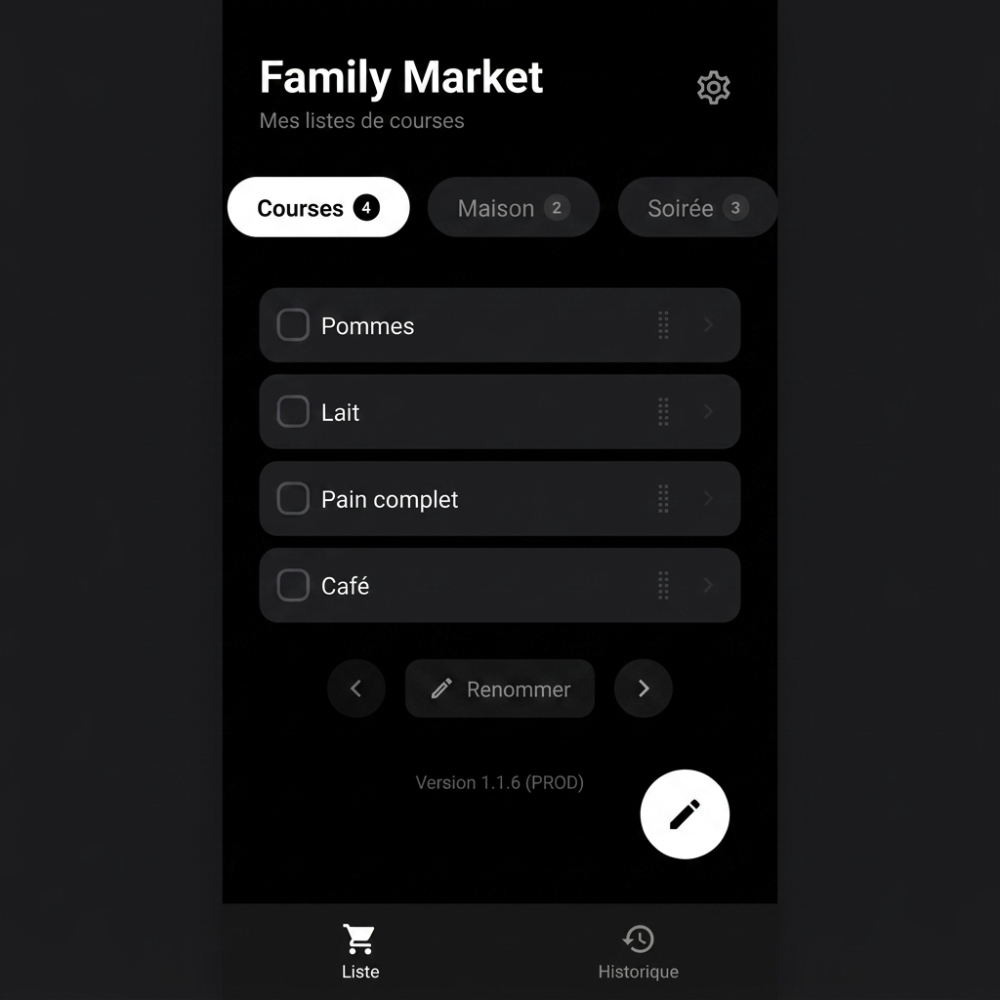

# Family Market 🛒

**Family Market** est une application mobile collaborative conçue pour simplifier la gestion des courses en famille. Finis les oublis et les appels de dernière minute : tout le monde partage les mêmes listes en temps réel.



## 🌟 Pourquoi utiliser Family Market ?

- **Synchronisation Instantanée** : Un article ajouté par l'un apparaît immédiatement sur le téléphone des autres.
- **Multi-listes** : Créez des listes séparées pour les courses hebdomadaires, le bricolage, ou une soirée spéciale.
- **Mode Hors-ligne** : Continuez à cocher vos articles même au fond d'un supermarché sans réseau. L'app se synchronise automatiquement dès que vous retrouvez une connexion.
- **Journal d'Activité** : Gardez un œil sur qui a ajouté ou acheté quoi grâce à l'historique détaillé.
- **Design Premium** : Une interface sombre (Onyx Pro) élégante, fluide et intuitive.

---

## 🚀 Commencer

### 1. Installation
Clonez le dépôt et installez les dépendances :
```bash
npm install
```

### 2. Configuration Firebase
L'application nécessite une instance Firebase pour fonctionner. 
1. Créez un projet sur la [Console Firebase](https://console.firebase.google.com/).
2. Activez **Firestore Database**.
3. Créez un fichier `.env` à la racine (basé sur les instructions de la [Documentation Technique](./DOCUMENTATION.md)).

---

## 📱 Tester et Déployer

### Tester avec Expo Go
C'est la méthode la plus rapide pour essayer l'application sur votre propre téléphone :
1. Installez l'application **Expo Go** (Android/iOS) sur votre mobile.
2. Lancez le serveur local : `npm start`
3. Scannez le QR Code affiché dans votre terminal.

### Générer l'APK (Android)
Pour installer l'application de façon permanente sans passer par Expo Go :
1. Assurez-vous d'avoir configuré votre compte [EAS](https://expo.dev/eas).
2. Lancez la commande suivante :
```bash
npx eas-cli build --platform android --profile preview
```
3. Une fois le build terminé, téléchargez l'APK via le lien fourni et installez-le.

---

## 🛠️ Aspect Technique
Pour plus de détails sur l'architecture, la gestion du cache hors-ligne, le système de notifications ou la structure des données, consultez la :

👉 **[Documentation Technique Complète](./DOCUMENTATION.md)**

---
*Développé avec ❤️ pour la famille.*
