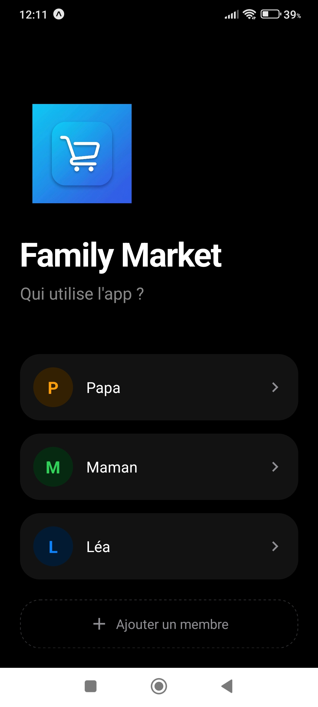
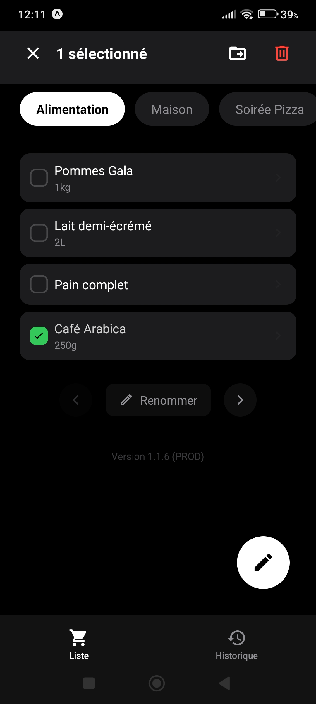
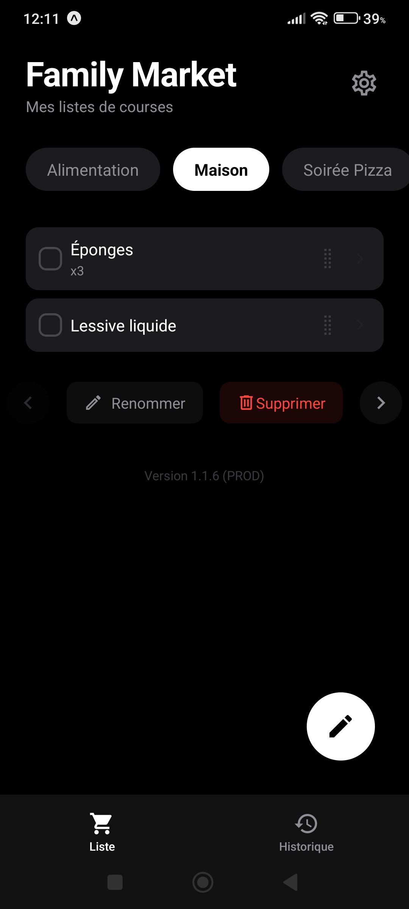
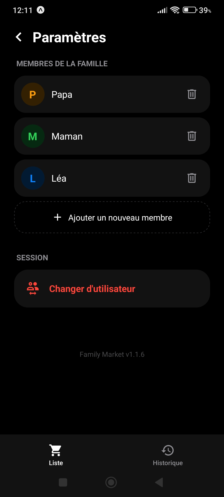

# Family Market

Plateforme collaborative de gestion de listes de courses conçue pour simplifier l'organisation domestique. Family Market permet à tous les membres d'un foyer de partager, modifier et suivre l'état de leurs besoins en temps réel.

|  |  |
| :---: | :---: |
|  |  |

## Fonctionnalités

*   **Synchronisation en direct** : Mise à jour instantanée des listes sur tous les appareils connectés via Firebase Cloud Messaging.
*   **Gestion multi-listes** : Organisation des besoins par thématique (Alimentation, Bricolage, Pharmacie, etc.).
*   **Résilience hors-ligne** : Système de mise en cache locale permettant l'utilisation de l'application sans connexion réseau, avec synchronisation automatique lors du rétablissement de l'accès.
*   **Historique des actions** : Journalisation détaillée des modifications permettant de savoir quel utilisateur a ajouté ou validé un article.
*   **Interface optimisée** : Design moderne en mode sombre (Thème Onyx Pro) privilégiant la lisibilité et la rapidité d'exécution.

## Installation

### Configuration initiale
Commencez par installer les dépendances du projet :
```bash
npm install
```

### Configuration des services
L'application repose sur l'écosystème Google Firebase pour la persistence et la synchronisation des données.
1. Créez un projet sur la console Firebase.
2. Activez le service Google Firestore.
3. Configurez vos variables d'environnement dans un fichier `.env` à la racine du projet conformément aux indications de la [Documentation Technique](./DOCUMENTATION.md).

---

## Utilisation et Déploiement

### Environnement de test (Expo Go)
Pour tester l'application rapidement sur un appareil physique :
1. Installez l'application **Expo Go** sur votre terminal Android ou iOS.
2. Dans le répertoire du projet, lancez : `npm start`
3. Scannez le QR Code généré dans la console.

### Compilation et génération d'un APK
Pour produire une version autonome pour Android :
1. Configurez vos identifiants via EAS CLI.
2. Exécutez la commande de build :
```bash
npx eas-cli build --platform android --profile preview
```
3. Suivez le lien fourni pour télécharger et installer le fichier APK sur votre appareil.

---

## Architecture et Documentation Technique

Pour des informations détaillées sur l'architecture logicielle, la structure des données Firestore, ou la gestion des notifications push, veuillez consulter le document suivant :

[Consulter la Documentation Technique](./DOCUMENTATION.md)
